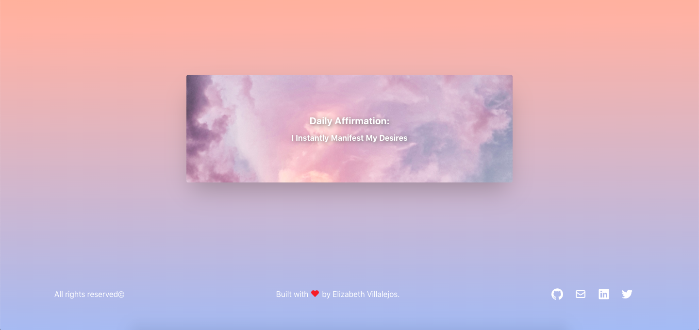

# 💻 Dulce Namaste (BETA)
The word affirmation comes from the Latin affirmare, originally meaning "to make steady, strengthen." 
Affirmations are proven methods of self-improvement because of their ability to rewire our brains. [Link](https://www.huffpost.com/entry/affirmations_b_3527028)  
To help out, Dulce gives you a daily affirmation. 
Built with React and TypeScript. 
Powered by coffee :coffee: and barks :dog:. 

## 🔨 Tools
- TypeScript
- React
- React-DOM
- React-Create-App
- Tailwind CSS
- Npm
- ES6

## ✨ Live Demo

You can look at it [here.](https://dulce-namaste.netlify.app/)

## ⚒️ To-do

- Implement light/dark mode toggle
- Loading a new affirmation on card flip action

## Author

👤 Elizabeth Villalejos

- [Github](https://github.com/misselliev)
- [Linkedin](https://linkedin.com/ellievillalejos)
- [Dev.to](https://dev.to/misselliev)
- [Twitter](https://twitter.com/miss_elliev/)
- [Instagram](https://www.instagram.com/miss_elliev/)
- [Email](mailto:elizabeth.villalejos@gmail.com?subject=Website%20Inquiry)

## 🤝 Contributing

Contributions, issues and feature requests are welcome!

Feel free to check the [issues page](issues/).

## Show your support

Give a ⭐️ if you like this project!

> “What simple action could you take today to produce a new momentum toward success in your life?” Tony Robbins
